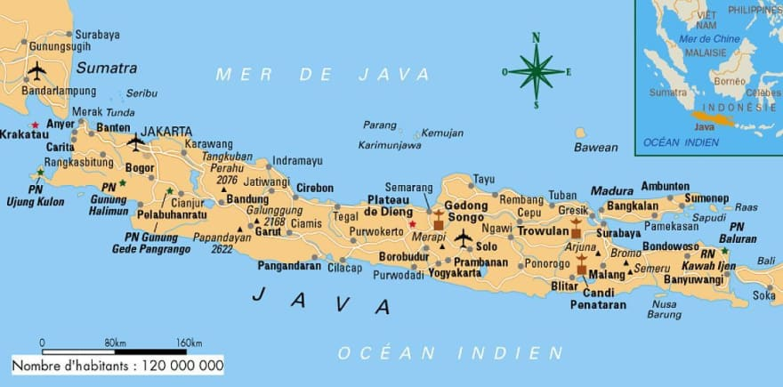
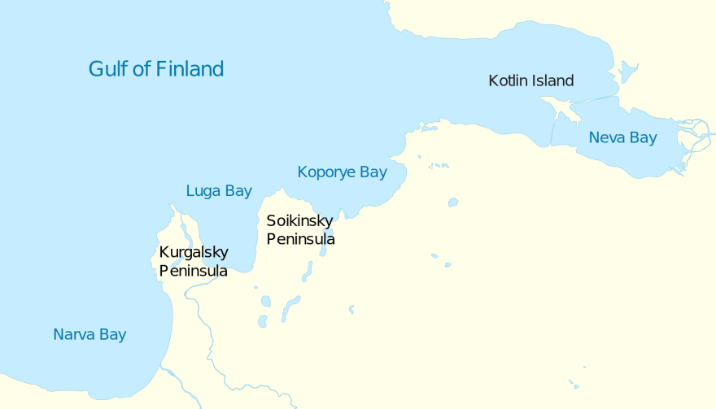
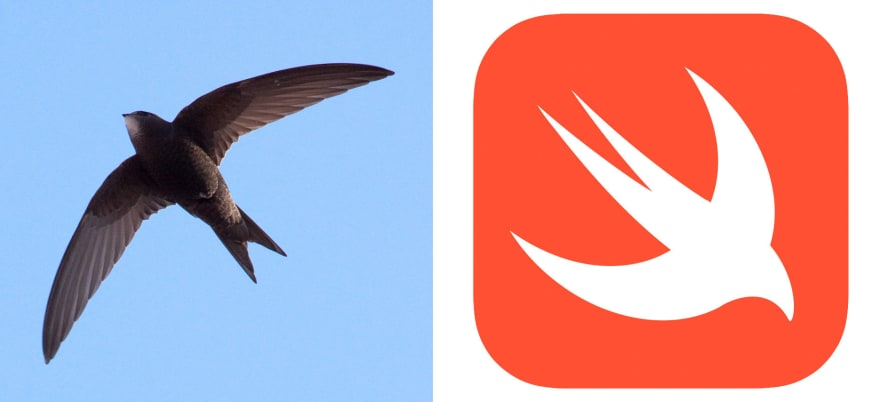

원문: [How programming languages got their names](https://dev.to/scottydocs/how-programming-languages-got-their-names-207e)

필 칼튼 (Phil Karlton) 은 컴퓨터 과학 (Computer Science) 에서 어려운 것이 딱 두 가지가 있다고 말했다. "캐시 무효화 (cache invalidation) 과 이름 짓기" 가 그것들이며, 후자 때문에 기술 분야에 이상하지만 멋진 이름들이 생겨났다. 이 글에서 일반적인 프로그래밍 언어의 이름을 살펴보고 왜 그 이름들이 선택 되었고, 어디서 왔는지 알아보자.

## Perl

펄은 1987년 미국인 개발자 래리 월 (Larry Wall) 이 만들었다. 그는 처음에 펄 (Pearl) 이라는 긍정적인 연관이 있는 짧고 기억하기 쉬운 단어라고 생각해서 채택했다. 하지만 이미 그 이름의 언어가 존재했기 때문에 철자를 Perl 로 바꿨다. Perl 로 만든 배크로님 (철자에 맞춰서 약어를 만든 것) 은 Practical Extraction and Reporting Language (실용적인 추출 및 보고 언어) 가 있다. *pearl* 이라는 단어는 '구슬' 또는 '가치있는 것' 을 의미하는 옛날 프랑스어 *perle* 와 양다리처럼 생긴 연체동물까지 아우르는 '다리' 라는 뜻의 라틴어 *perna* 에서 왔다.

## Ruby

[Dev.to](https://dev.to/) 를 만드는데 사용한 언어인 루비 (Ruby) 는 1990년대에 일본인 개발자 유키히로 "마츠" 마츠모토가 개발했다. 펄에 영향을 받아서 그는 보석으로 이름을 짓고 싶어 했고, 때마침 그의 동료의 탄생석이자 6월의 탄생석인 진주 (펄; pearl) 의 다음달인 7월의 탄생석인 루비를 택했다. *ruby* 라는 단어는 '붉은색' 이라는 뜻의 라틴어 *rubeus* 에서 온 '붉은 보석' 이라는 뜻의 옛날 프랑스어 *rubi* 에 그 기원을 둔다.

## Python

네덜란드 프로그래머 귀도 반 뤼섬 (Guido van Rossum) 은 1991년 파이썬을 만들었고, 몬티 파이썬의 플라잉 서커스 (Month Python's Flying Circus) 라는 영국 텔레비전 코미디쇼에서 이름을 따왔는데, 때마침 그 쇼의 대본을 읽고 있었기 때문이다. 그는 "[짧고, 특별하고 조금은 신비로운](https://docs.python.org/2/faq/general.html#why-is-it-called-python)" 이름을 원했다. *python* 이라는 이름은 아폴로 신이 죽인 거대한 해양생물인 고대 그리스의 *Puthón* 에서 따왔다. 이 단어는 19세기 초반부터 먹이를 단단히 죄는 거대하고 단단한 몸을 가지되 독이 없는 다양한 종류의 뱀을 일컫는 말로 사용되었다.

## Java

자바는 1990년대에 제임스 고슬링 (James Gosling) 이 선 마이크로시스템즈 (Sun Microsystems) 에서 일할 때 만들었다. 그 프로젝트는 원래 'Oak' 라고 불렸었는데, 카페인을 엄청나게 소비한 브레인스토밍 시간을 가진 뒤 'Java' 라는 이름이 생겼다 (비록 'Silk' 로 정해질 뻔하긴 했지만). 인도네시아어로 *Java* 또는 *Jawa* 는 강하고 진하고 달콤한 커피를 생산하는 큰 섬의 이름이다. 이 단어는 1800년대부터 미국에서 커피를 뜻하는 말로 쓰이고 있다.

## Kotlin

2011년 젯브레인즈(JetBrains) 가 발표한 언어인 코틀린은 러시아의 코틀린 섬 (Kotlin Island) 에서 이름을 따왔다. 개발팀은 Java 처럼 섬의 이름을 따서 이름을 짓고 싶었다. 비록 섬 이름이 아니라 커피이기는 하지만! 코틀린 (러시아어로는 Котлин) 은 스웨덴 땅이었으며, 핀란드인들에게는 '여우섬' 이라는 뜻의 *Kettusaari* 로, 스웨덴인들에게는 *Ketlingen* 로 불렸고, 이 이름은 아마도 가마솥을 의미하는 독일어 *kettel* 에서 왔을 수 있다. 1703년 표트르 대제가 그 섬의 통제권을 획득하고 *Kotling* 으로 이름을 바꿨고 이후에 *Kotlin* 으로 줄였다.

## Swift

애플이 자신들이 개발한 언어의 이름을 Swift 라고 지은 명확한 이유는 없지만 [Quora 에 누군가가 물었듯이](https://www.quora.com/Is-the-Swift-programming-language-named-after-Taylor-Swift) 테일러 스위프트 (Taylor Swift) 에서 온 것은 절대 아니다. 내 생각에는 애플이 뭔가 빠르다는 인상을 주기 위한 게 아닌가 싶다. *swift* 는 '굉장히 빠른 속력 또는 속도로 움직임' 이라는 뜻이며, 이는 선사시대로 올라가 '쓸어다니며 움직임' 이라는 뜻의 *swipt-* 까지 거슬러 올라간다. 17세기부터 제비처럼 생긴 새들이 swift 로 알려졌으며, 이 프로그래밍 언어의 로고로도 사용하고 있다.

## Bash

Bash 는 개발자 스테판 본 (Stephen Bourne) 의 이름을 딴 Bourne Shell 이 "새로 태어났다 (born again)" 는 말장난인 Bourne-again Shell 을 줄여서 만든 것이다.

## C

C 라는 이름은 굉장히 쉽게 지어졌는데, B 라는 프로그래밍 언어 다음에 나왔기 때문이다. C 는 C++ 와 C# 과 같은 언어들로 확장되었다.

## Clojure

개발자는 'c' (C#), 'l' (Lisp), 그리고 'j' (Java) 를 포함했으면 했고, 'closure' 와 비슷한 말장난이기도 하다.

## JavaScript

## R

R 은 최초의 두 개발자 (Ross Ihaka 와 Robert Gentleman) 의 이름에서 따오기도 했고, 이전에 있던 언어인 S 의 다음 글자라서 R 로 정한 것도 있다.

## Scala

Scala 는 'scalable' 과 'language' 의 앞글자를 따서 만들었다. 이 단어는 이탈리아어로 'stairway' (계단) 을 의미하기도 하고, Scala 가 사용자들이 더 나은 언어로 나아갈 수 있도록 도와주기도 한다.

## SQL

처음에는 "Structured English Query Language" (SEQUEL; 구조화된 영문 질의 언어) 로 불렸고, "sequal" 이라고 발음했다. 이후에 SQL 로 줄여서 부르기 시작했다.

## TypeScript

JavaScript 에서 아쉬웠던 것 때문에 개발 되어서 비슷한 이름으로 지었다.

You can follow me on Twitter at @TheStrangeRoots for Tweets about the origin of different words used in technology.

트위터에서 [@TheStrangeRoots](https://twitter.com/thestrangeroots) 를 팔로우 하면 IT 분야의 보다 다양한 언어의 기원에 대한 트윗을 볼 수 있다.
